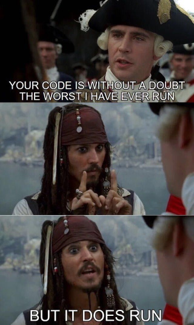

# Current status: broken & refacturing
I'm trying to get this project working again.

## Background
When I started at Xebia in 2015 Docker was hip and new and I wanted to understand it better. As I was getting tired of continuously rebuilding vulnerable testing environments I thought it was a nice idea to see if I could put them all in 1 docker container, so that a simple restart would refresh everything. I also wanted to see if I could break docker by putting so many things in 1 container. Turns out docker is really flexible and has no problem with running multiple webservers and databases at the same time. In 2016 I lost interest in the project as I was no longer using it and I didn't feel like maintaining all the dependencies anymore.
In 2022 @commjoen challenged me to revamp the project, so here we are :)

## Note
This is a very bad idea and probably one of the best examples of how not to use docker. 

## Damn Vulnerable eXtensive Training Environment
DVXTE is a docker container with several vulnerable applications.
By using a docker container it's easy to setup and can easily be reset to it's starting point.

Currently the following training environments are implemented in the Docker container:
  * DVWA          https://github.com/digininja/DVWA
  * DVWServices   https://github.com/snoopysecurity/dvws
  * DVWSockets    https://github.com/interference-security/DVWS
  * WebGoat       https://github.com/WebGoat/WebGoat
  * Juiceshop     https://github.com/bkimminich/juice-shop
  * Railsgoat     https://github.com/OWASP/railsgoat
  * django.NV     https://github.com/nVisium/django.nV
  * Buggy Bank    https://www.mavensecurity.com/about/webmaven/
  * Mutilidae II  https://github.com/webpwnized/mutillidae.git
  
Next to those, the following tools are installed:
  * Mailcatcher   https://mailcatcher.me/
  * Brakeman      http://brakemanscanner.org/

Once build, the image currently has a size of roughly 1.4GB
